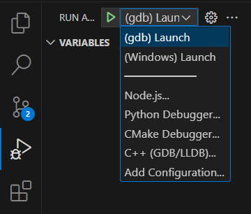

# Pointer Lab
## What is this
- This repository is a collections of examples aim to help you understand the core concept of pointer.
- I also have plans to include some new applications of pointer so do expect that this repos will be updated in the near future.
## What You Can Expect
- Clean, modularzied examples
- Vase usages of pointer
- Pre-cautions when using pointers
- Cursed and unethical way to abuse pointer
# 🛠️ Prerequisites
## Compiler
### Linux
- You need to have **G++**, **GCC** and **GDB** (GNU Debugger) installed. If it's not already available, install it using your package manager:
    ```bash
    sudo apt-get install gcc g++ gdb
    ```
- You can check the version of your packages using
    ```bash
    g++ --version
    ```
    ```bash
    gcc --version
    ```
    ```bash
    gdb --version
    ```
### Windows
- Make sure to install **Desktop development with C++** via the **Visual Studio Installer**. This includes the necessary compilers and tools like cl.exe.

## IDE
- The IDE used for these labs is **Visual Studio Code**. You can download and install it from VS Code's <a href="https://code.visualstudio.com/Download" target="blank">offical website</a>.

# How to run
### 1. Clone the repository
```bash
git clone https://github.com/HoangPi/pointer_labs.git
cd pointer_labs
code .
```
### 2. Launch or debug
- Open the <code>.cpp</code> file you want to run.
- Open **Run and Debug** from **Activity Bar** or use <code>Ctr + Shift + D</code>.
- Select **(gdb) Launch** if you are running in **Linux** or **(Windows) Launch** if you are in **Windows**.

- Click **Start debugging** button or press the <code>f5</code> key.
### How to set up breakpoints
 - Honestly, if you are this far, you should know how to do so, so I'm not gonna say anything.
## Important note for Windows  user
- Installing **Desktop development with C++** does not paths to compiler nor standard libraries.
- So you need to start the IDE from **Developer Command Prompt for VS** just for the sub processes to know where things are.
- You will need do **step 1** even before cloning step and both **steps 1** and **2** every time you want to open the project.
    -  **Step 1:** Search and open **Develop Command Prompt for VS** in your Windows search bar.
    - **Step 2:** Run <code>code path/to/the/project</code>

# License
This project is licensed under the MIT License. See the <a href="./LICENSE" target="_blank">LICENSE</a> file for more details.
# Contact
- **Email**
    - voduchoangphi@gmail.com
    - 20110432@student.hcmute.edu.vn